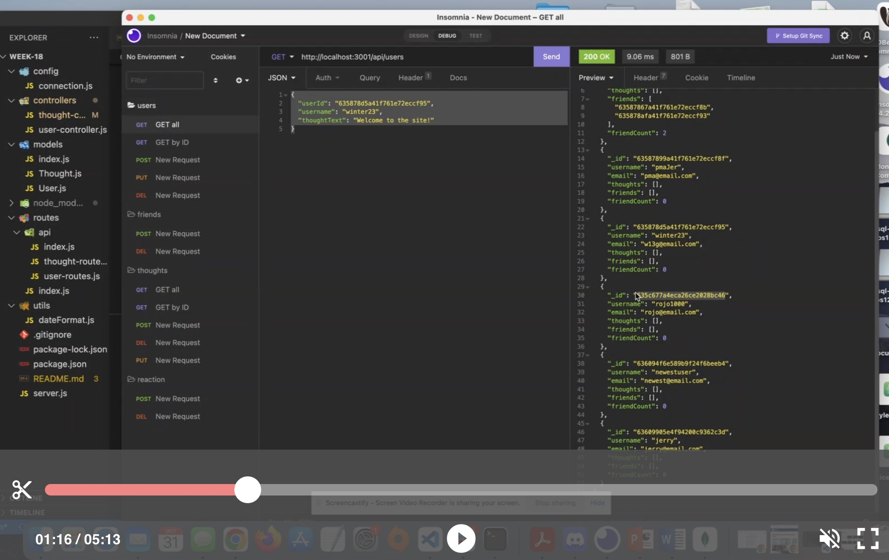

# NoSQL: Social Network API

## Description

MongoDB is a popular choice for many social networks due to its speed with large amounts of data and flexibility with unstructured data. This project is an API for a social network web application where users can share their thoughts, react to friends’ thoughts, and create a friend list. Applications used are Express.js for routing, a MongoDB database, and the Mongoose ODM. 

## User Story

```md
AS A social media startup
I WANT an API for my social network that uses a NoSQL database
SO THAT my website can handle large amounts of unstructured data
```

## Walkthrough video

https://drive.google.com/file/d/1pNfPsOmJlV7M9HhYLIyUTyGmSjpaF8jH/view




